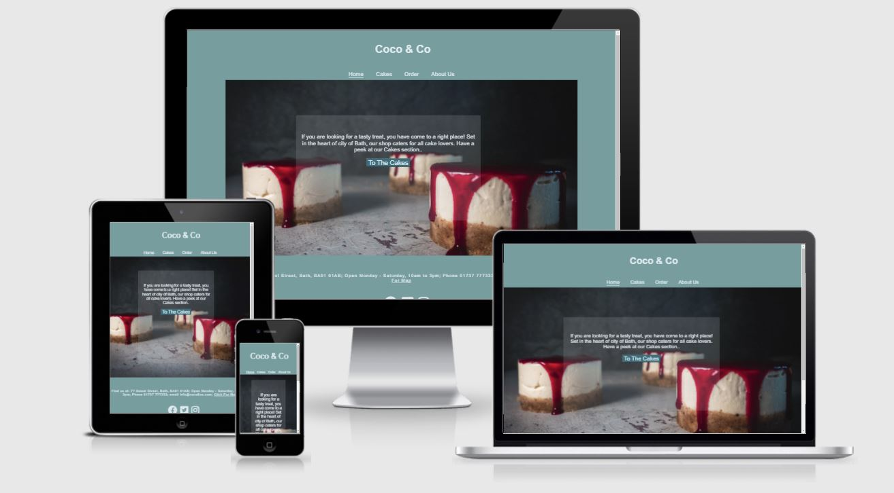
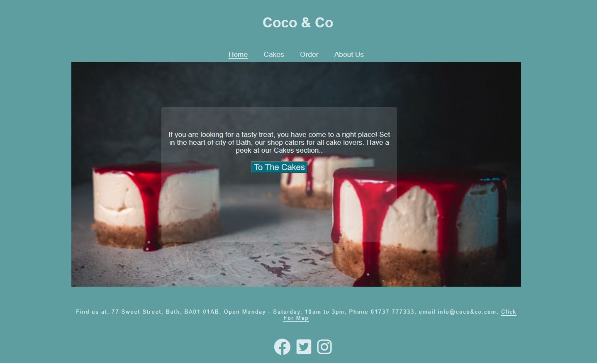
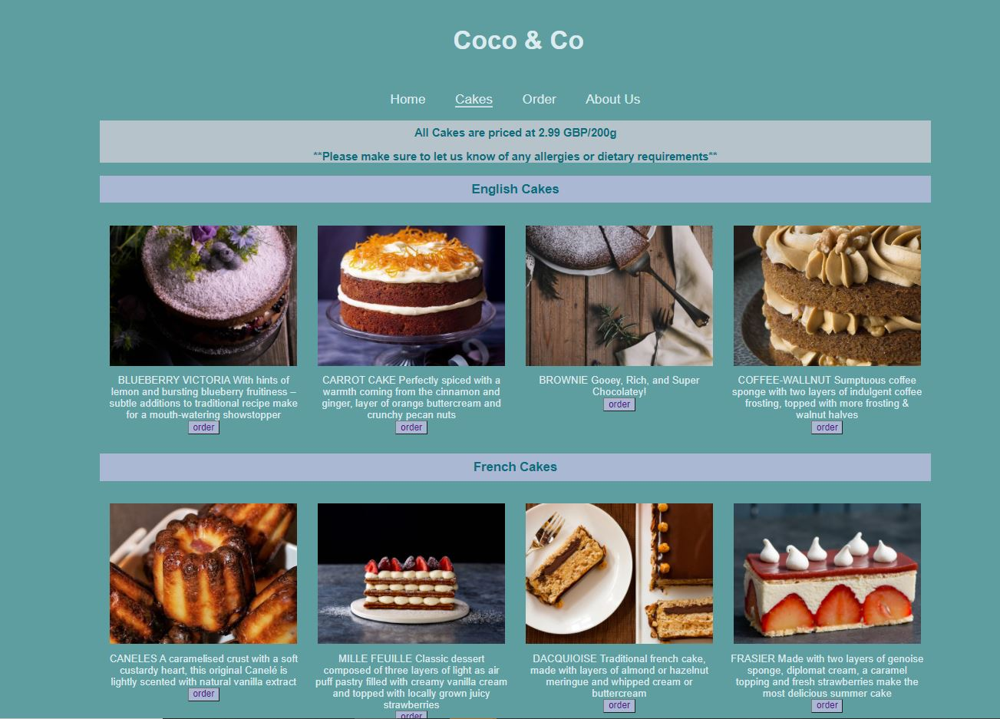
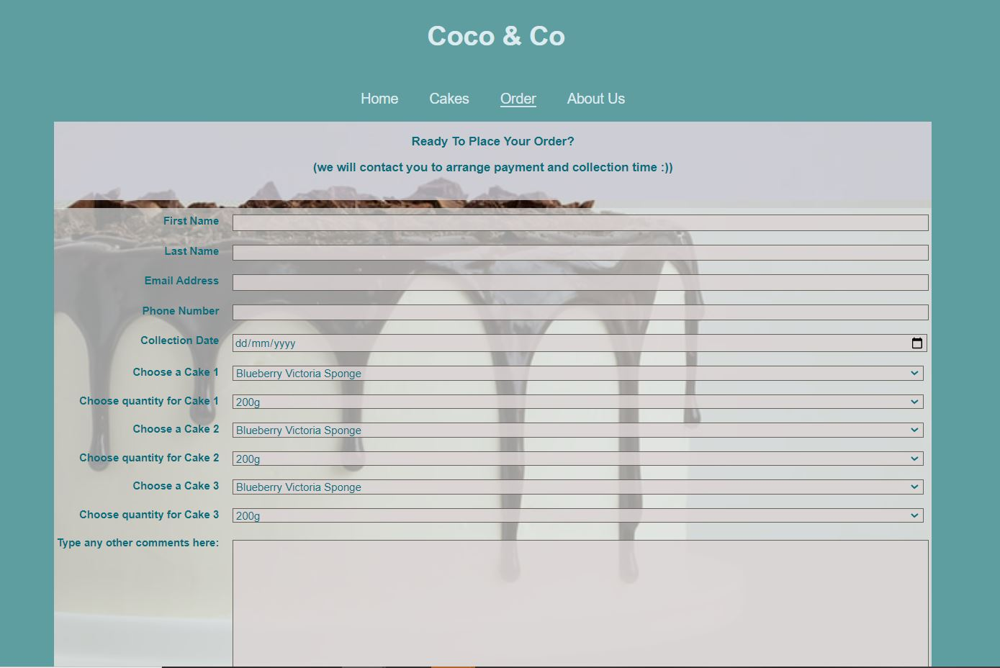
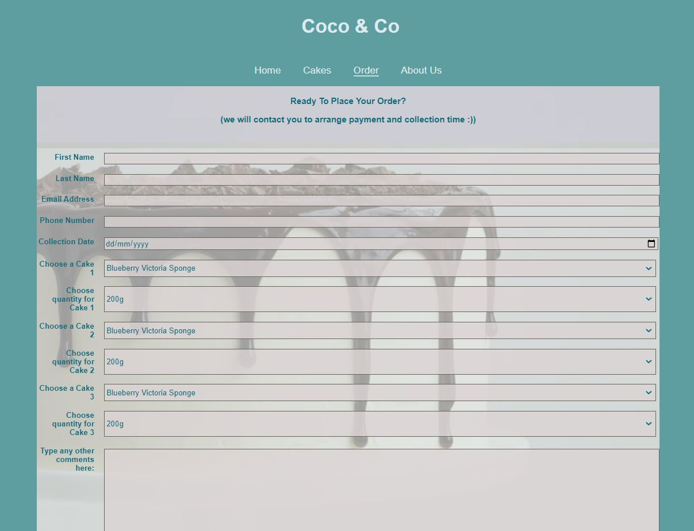
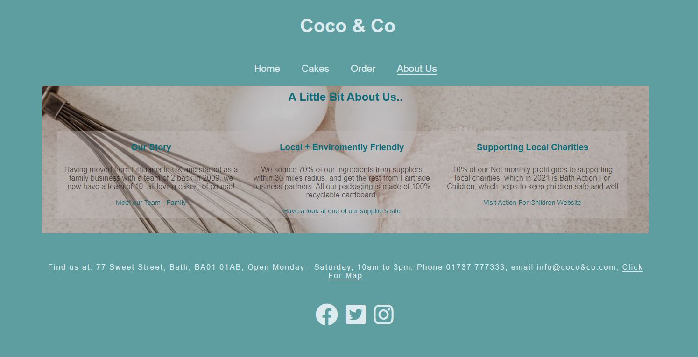
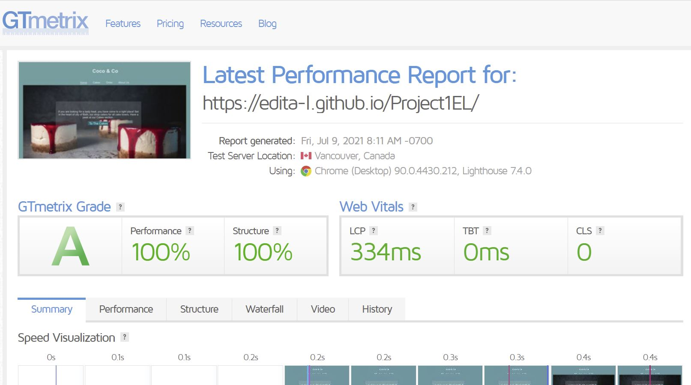

 

# Coco & Co Sweet Bakes Shop

## https://edita-l.github.io/Project1EL/

---
## **Contents**
1. Introduction
2. UX
3. Wireframe
4. Visual Identity
5. Site Overview
6. User Stories
7. Testing

---

## Introduction

*Note: This site is for a fictitious business, created purely for the purpose of my 1st Project. It is my first Milestone for the Code Institute Diploma in Full Stack Development*

Coco &Co is a Bakery shop in Bath, offering to buy selection of English, French and Lithuanian cakes, baked from mainly locally grown and sourced produce. It is created by and for lovers of sweet bakes who are looking to buy a treat in Bath area.

---

## User Experience (UX)

I have attampted to create an uncluttered and  responsive site with a very simple and clean home page where the main feature is an inviting backround and an easy access to The Cake page where a range of products is displayed.  Full viewport sets the tone for the rest of the site. The goal is to give a clear idea of products offered and use bright and inviting colours.

- **The header and footer:**
    *   consistent throughout Home, Cakes, Order and About Us pages;
     *  Navigation bar and Logo in the center of the Header allows quick access to each page without having to click Back button;
    *    Footer Bar running though each page gives Opening times, Location of the Shop by clickbale Find Us Link (which takes user to google maps) as well as links to social media accounts;
    *    design is identiacal throughout the site on all pages for continuity. 

*   **Home page:**

    The home page design is very simple - the main feature is a  relavant background photo that covers the full viewport. The goal is to give a clear inclination of products offered and easy access to product display page.

    In the center a jumbotron was used, within which is a Button Link The Cakes page. This invites and allows an easy and quick access to viewing products.
    
    Concept for my site is to have many sections interlinked, which I feel makes it more accessible.

* **Cakes page:**

    The simple and responsive layout is achieved by using a flex system with different areas for a list of products offered, divided into main English/French/Lithuanian sections as well as photos to give clear idea of product to enhance the visual experience.

    Each section has four cakes options with names and brief description of each.

    There is a link to the ordering page from the bottom of each product card as well as an easy option of getting back to Home page without having to use Back button - by clicking on the Logo at the top of page.

    The main page heading gives clear information about the prices and reminder for any allergy notifications.

* **Order page:**

    The main feature of the Order page is a Form Section, giving options for enetering diiferent satyle data and submitting information via clickable button once user is ready to send the order/request.

    It also has a full background cover image to keep in style with the rest of the site and within bakery theme.

* **About Us page:**

    About page follows the theme with a another background image of baking ingredients, and includes three dividers with some information about ethos of business.

Due to having a few large images on the site which took long to load and for the purpose of improving user experience, I have compressed the images using tinypng.co.

---

## Wireframe

The wireframe was designed using Balsamiq.
It has a basic intial structure, which remained throughout the project, with the styling slightly changed/enchanced for better viewing experience.

Below is a link to all my wireframes:

---

## Visual Identity

 For the logo, I wanted to use a simple word format in a classical font, to make it universal and appealing.

 I have used mainly combination of three colors, to enchance contunuity, seperate sections and to keep it uniform.
 The Cake page has an addition of extra color, to seperate sections and to make it tthe slightly unique central point of site.

 The Header and Footer are in the same font color, with clickable link changing to indigo on hovering, again, to keep it uniform and to give preditability for user.

 ## Site Overview

 Images below show overview of the site:
 

 

 

 

 

---
## User Stories

Users:
*The site is designed for people looking to buy some cake either by placing order online or by visiting shop in Bath.*

*  As a user, I'd like to easily see information about shop address and opening times.
* As a user, I'd like to see different cakes available to buy and to read breif description of them.
* As a user, I'd like to know if bsuiness is sustainable and dedicated to being enviroment friendly.
* As a user, I'd like to see photos and social media posts showing the business as it operates on a daily basis.
* As a user, I'd like to be able to contact the shop easily either by phone or email.
* As a user, id like to access location through google maps by a click and not having to type in address.

Coco&Co business owner:

* As a business owner, I'd like to show potential customers that they will have a good choice of cakes, clearly priced.
*   As a business owner, I'd like for potential customers to have a clear idea of our business location and opening times.
*    As a business owner, I'd like for potential customers to have an understanding of where we come from and our ethos as abusiness.
*   As a business owner, I want to offer customers the option of ordering via the site.
*   As a business owner, I'd like to share a glimpse of our life through our social media posts.
*   As a business owner, it's important to me that any user/ potential customer viewing the site has the best experience and is able to easily access all the relevant sections with one click.

## Testing 
My website has been tested through the GTMetrix site,   
[GTmetrix](https://gtmetrix.com "GTmetrix Homepage")
Below is a screenshot of the results achieved, with performance and structure graded A by GTmetrix.

The site was tested on various platforms to ensure proper display across different screen sizes.

The HTML was validated on W3C Validator and speed tested on Pingdom

 

